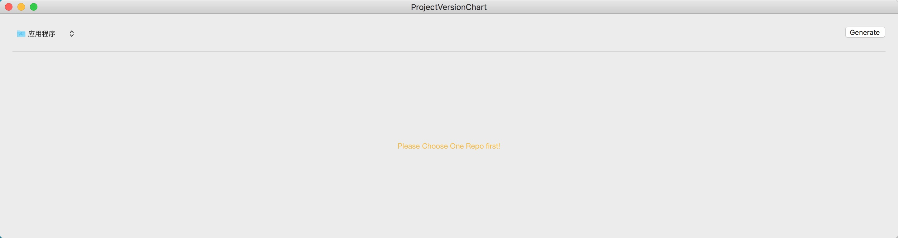
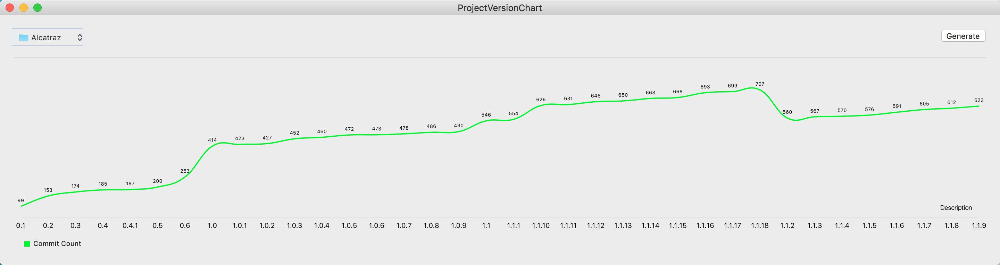

#repo-tag-chart

it's a Mac app to show line chart which x Axis shows tag name, and y Axis shows commit count.

## Features
  * [ ] Support Multiple-Type Charts
  * [ ] More Detail Info about Tag
  * [ ] More Options like `remote`, `branch`

## Why It Exists
sometimes, you find your project or your company's has been long time, and you want to see the diff between releases (anotated tag usually).

## Installation & Usage
download latest [Release](https://github.com/MickeyHub/repo-tag-chart/releases/download/v0.1.0/ProjectVersionChart.app.zip) to your local, open it by double-click, you will see

As tip said, you should choose one repo first, click path control on right left-top corner, then you just click at `Generate` button, the chart will show below. like:

## Licence
The MIT License (MIT)

Copyright (c) 2016 MickeySha

Permission is hereby granted, free of charge, to any person obtaining a copy
of this software and associated documentation files (the "Software"), to deal
in the Software without restriction, including without limitation the rights
to use, copy, modify, merge, publish, distribute, sublicense, and/or sell
copies of the Software, and to permit persons to whom the Software is
furnished to do so, subject to the following conditions:

The above copyright notice and this permission notice shall be included in all
copies or substantial portions of the Software.

THE SOFTWARE IS PROVIDED "AS IS", WITHOUT WARRANTY OF ANY KIND, EXPRESS OR
IMPLIED, INCLUDING BUT NOT LIMITED TO THE WARRANTIES OF MERCHANTABILITY,
FITNESS FOR A PARTICULAR PURPOSE AND NONINFRINGEMENT. IN NO EVENT SHALL THE
AUTHORS OR COPYRIGHT HOLDERS BE LIABLE FOR ANY CLAIM, DAMAGES OR OTHER
LIABILITY, WHETHER IN AN ACTION OF CONTRACT, TORT OR OTHERWISE, ARISING FROM,
OUT OF OR IN CONNECTION WITH THE SOFTWARE OR THE USE OR OTHER DEALINGS IN THE
SOFTWARE.
